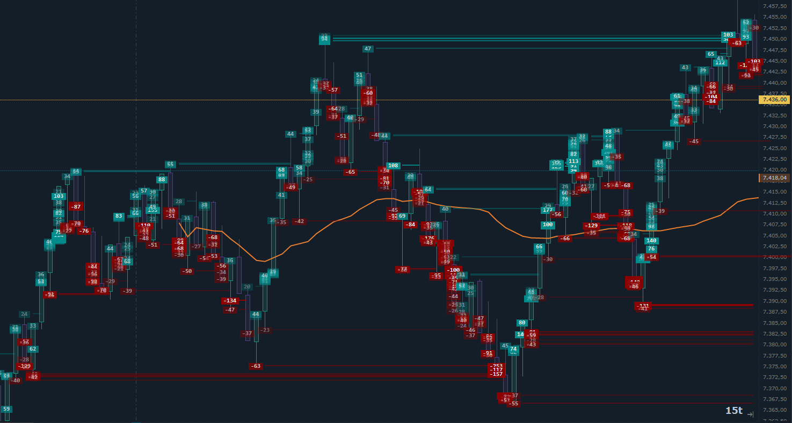

# Big Trade Trap

Indicator for **Quantower** that visually identifies **trap levels** on the chart, based on Volume Analysis.

## Support the Project

If this indicator helps your trading, consider supporting development:

[Donate with ko-fi] https://ko-fi.com/wolfhacktrader

## How it works

The indicator analyzes the **Price Levels** from Volume Analysis and calculates for each level:

- **Buy %** — percentage of buy volume
- **Sell %** — percentage of sell volume
- **Delta %** — absolute difference between buy and sell, normalized

A level is marked as a **trap** when:

- Buy **or** sell percentage exceeds **70%**
- **Delta %** is greater than **60%** (strong directional imbalance)
- The trap level (`BuyVolume - SellVolume`) exceeds the configurable **minimum threshold** in absolute value

### Bull Trap (dominant buying)
Price moved up with high volume, but the delta shows buying dominates excessively — potential trap for buyers.

### Bear Trap (dominant selling)
Price moved down with high volume, but selling dominates excessively — potential trap for sellers.

## Chart elements

- **Label** at the level price showing the numeric trap value
- **Background rectangle** with configurable color (bull/bear) and alpha proportional to the absolute trap value
- **White text** with alpha proportional to the trap level
- **Horizontal line** starting from the next bar and ending when price returns to the level
- **Trap Day** — sum of all trap levels for the current day, displayed at the top right

## Parameters

| Parameter | Default | Description |
|-----------|---------|-------------|
| Min Trap Level | 20 | Minimum trap level value to display a level |
| Bull Color | DarkCyan | Background and line color for bull traps |
| Bear Color | DarkRed | Background and line color for bear traps |

## Requirements

- `Quantower` platform https://www.quantower.com
- Data with Volume Analysis available

## Installation

1. Copy `BigTraders.dll` to `C:\Quantower\Settings\Scripts\Indicators`
2. Add the indicator to the chart
