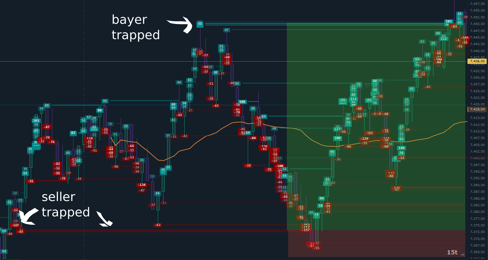

# Big Trade Trap 2.0

Indicator for **Quantower** that visually identifies **trap levels** on the chart, based on Volume Analysis. Traps are rendered as **volume-proportional bubbles** with a per-level life cycle, and older signals fade out over time.

## Support the Project

If this indicator helps your trading, consider supporting development:

[Donate with ko-fi](https://ko-fi.com/wolfhacktrader)

## How it works

The indicator analyzes the **Price Levels** from Volume Analysis and calculates for each level:

- **Buy %** — percentage of buy volume
- **Sell %** — percentage of sell volume
- **Delta %** — absolute difference between buy and sell, normalized

A level is marked as a **trap** when:

- Buy **or** sell percentage exceeds the **Trap Threshold** (default **80%**)
- **Delta %** is greater than the **Delta Threshold** (default **70%**) — strong directional imbalance
- The trap level (`BuyVolume - SellVolume`) exceeds the configurable **Min Trap Volume** in absolute value (default **100**)

### Bull Trap (dominant buying)
Price moved up with high volume, but the delta shows buying dominates excessively — potential trap for buyers.

### Bear Trap (dominant selling)
Price moved down with high volume, but selling dominates excessively — potential trap for sellers.

## Chart elements

- **Bubble** (or highlight box) at the level price, size proportional to the trap volume — bigger bubble = stronger trap in dollars
- **Numeric value** inside the bubble (absolute trap level)
- **Alpha** scaled by trap strength relative to the strongest trap on the chart, and by the trap's age
- **Horizontal line** from the next bar until the price returns to the level (only while the trap is *active*)
- **Chart title** showing the strongest trap currently on the chart (e.g. `Max Trap: Bull 5123 @ 1234.50`)
- **Alerts** (one-shot, live bars only) when a new trap appears: `New Bull Trap @ 1234.50 [5123]`

## Life cycle of a trap

| State | Meaning | Rendering |
|---|---|---|
| Trigger | Trap just created on the forming bar | Full color |
| Active | Line is extended bar by bar | Full color + horizontal line |
| Returned | Price came back to the level | Dimmed, no line, hidden when scrolled away |
| Invalid | Price **closed** through the level (thesis broken) | Faded, disappears after **Invalid Trap Fade** hours |

> Note: an entry bar whose own high (bull) already crossed the level is marked as a non-returning entry — the line stays hidden, it does **not** become Invalid. A trap is only Invalid once a **close** has passed through the level.

Active traps are removed after **Traps Lifetime** hours — the chart stays fresh.

## Parameters

| Parameter | Default | Description |
|-----------|---------|-------------|
| Min Trap Volume (absolute) | 100 | Minimum trap level value to display a level |
| Trap Threshold % | 80 | One-sided volume percentage needed |
| Delta Threshold % | 70 | Minimum directional imbalance % |
| Top Trap Only | false | Keep only the strongest buy/sell trap per bar |
| Bubble Mode | Bubble | Bubble vs. highlight box rendering |
| Bubble Size (px per volume) | 20 | Radius scale: `r = sqrt(trapVolume * scale)` |
| Max Bubble Radius (px) | 40 | Upper size clamp |
| Min Bubble Radius (px) | 8 | Lower size clamp |
| Show Level Lines | true | Draw the horizontal line until price returns |
| Bull Color | DarkCyan | Color for bull (buy-dominant) traps |
| Bear Color | DarkRed | Color for bear (sell-dominant) traps |
| Traps Lifetime (hours) | 48 | After this, traps fade out completely |
| Invalid Trap Fade (hours) | 24 | Fade duration for invalidated traps |
| Show Invalid Traps | true | Render invalidated traps at all |
| Show Returned Traps | true | Render returned traps at all |
| Enable New Trap Alerts | true | One-shot alert on new traps (live bars only) |
| Play Alert Sound | true | Sound with the alert |
| Show Chart Title (max trap) | true | Strongest-trap summary in the chart title |

## Requirements

- `Quantower` platform https://www.quantower.com
- Data with Volume Analysis available

## Installation

1. Build the script (Quantower: Script Editor → Compile) or copy `BigTradeTrap.dll` to `C:\Quantower\Settings\Scripts\Indicators`
2. Add the indicator to the chart

> Note: the included `BigTradeTrap.dll` is the **v1.1** binary. Compile this source to get the v2.0 features (bubbles, lifecycle, alerts).
